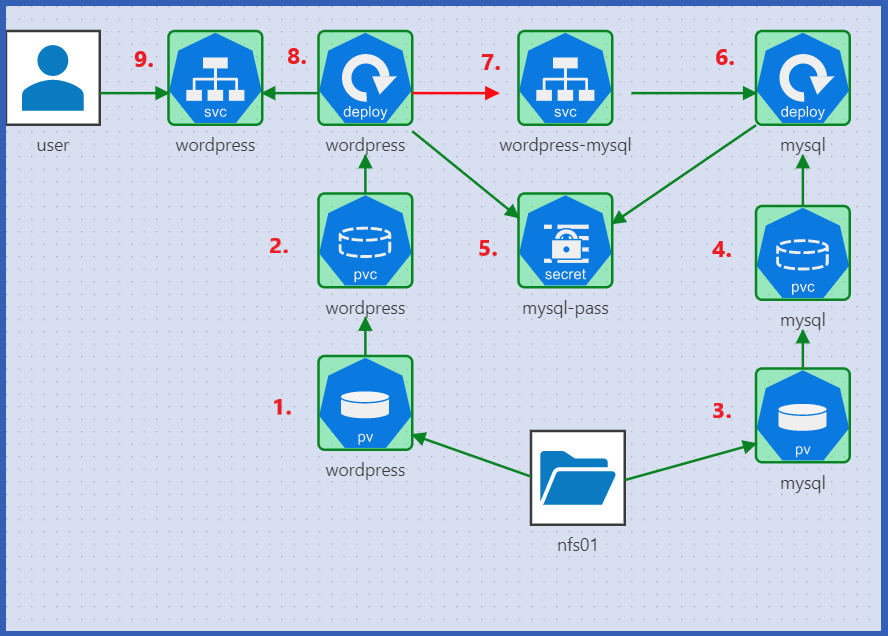

# wordpress-k8
Kubernetes challenge - Wordpress App.
This is the solution for the Wordpress App challenge which has been described in https://kodekloud.com/

It can be deployed in any Kebernetes cluster.

### The architecture specified in the challenge


### Solution
#### 1. Deploy PV for wordpress
```bash
kubectl create -f pv-wordpress.yaml
```

#### 2. Deploy PVC for wordpress
```bash
kubectl create -f pv-wordpress.yaml
```

#### 3. Deploy PV for mysql
```bash
kubectl create -f pv-mysql.yaml
```

#### 4. Deploy PVC for mysql
```bash
kubectl create -f pvc-mysql.yaml
```

#### 5. Create a secret
```bash
kubectl create secret generic mysql-pass --from-literal=password=admin --from-literal=host=wordpress-mysql
```

#### 6. Deploy mysql
```bash
kubectl create -f mysql-deploy.yaml
```

#### 7. Deploy service wordpress-mysql
```bash
kubectl create -f svc-wp-mysql.yaml
```

#### 8. Deploy application wordpress
```bash
kubectl create -f wordpress-deploy.yaml
```

#### 9. Deploy service wordpress
```bash
kubectl create -f svc-wp.yaml
```


